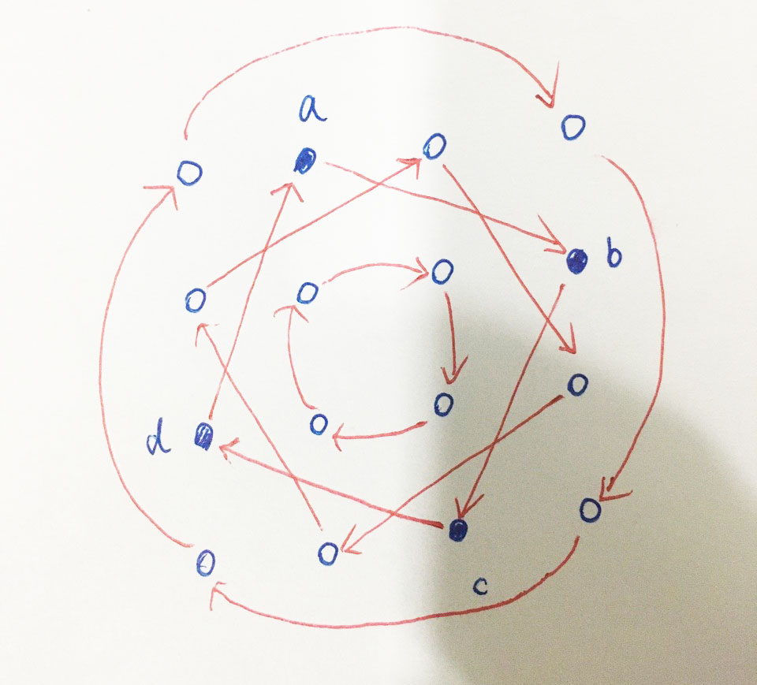

### 题目
You are given an n x n 2D matrix representing an image.<br>
Rotate the image by 90 degrees (clockwise).<br>

Each number in candidates may only be used once in the combination.<br>

** Note:**<br>
You have to rotate the image in-place, which means you have to modify the input 2D matrix directly. DO NOT allocate another 2D matrix and do the rotation.

#### example1
```
Given input matrix = 
[
  [1,2,3],
  [4,5,6],
  [7,8,9]
],

rotate the input matrix in-place such that it becomes:
[
  [7,4,1],
  [8,5,2],
  [9,6,3]
]
```

#### example2
```
Given input matrix =
[
  [ 5, 1, 9,11],
  [ 2, 4, 8,10],
  [13, 3, 6, 7],
  [15,14,12,16]
], 

rotate the input matrix in-place such that it becomes:
[
  [15,13, 2, 5],
  [14, 3, 4, 1],
  [12, 6, 8, 9],
  [16, 7,10,11]
]
```

### 大意
矩阵旋转

### 思路
原址旋转:<br>
从外至内依次遍历每个元素，内层每次循环会处理4个数字，如下图：a->b->c->d->a<br>
转换规则:m[i][j]=m[n-1-j][i];<br>




